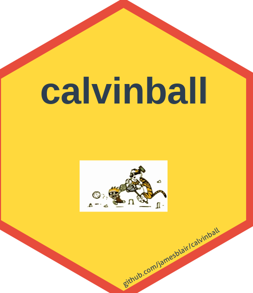

# calvinball 

<!-- badges: start -->
[](https://lifecycle.r-lib.org/articles/stages.html#experimental)
<!-- badges: end -->

> "The only permanent rule is that you can't play it the same way twice!" - Calvin

**calvinball** provides a synthetic sports dataset inspired by Calvinball, the legendary game from Bill Watterson's *Calvin and Hobbes* comic strip. The package is designed to be a fun, nostalgic dataset for teaching data exploration and EDA techniques.

## Installation
You can install the development version of calvinball from GitHub:

```r
# install.packages("pak")
pak::pak("jamesblair/calvinball")
```

## Quick Start

```r
library(calvinball)

# Six datasets are available immediately
head(cb_players)
head(cb_games)

# Generate fresh data with custom parameters
my_league <- generate_calvinball_data(n_players = 20, n_teams = 4, n_seasons = 2)
```

## Datasets

The package includes six pre-generated datasets:

| Dataset | Description | Rows |
|---------|-------------|------|
| `cb_players` | Player roster with team assignments | 30 |
| `cb_teams` | Team information | 6 |
| `cb_games` | Game results across 3 seasons | 150 |
| `cb_player_stats` | Individual player game statistics | 900 |
| `cb_player_summary` | Aggregated player career statistics | 30 |
| `cb_team_records` | Team win/loss/tie records by season | 18 |

## Calvinball Statistics

The dataset includes wonderfully absurd performance metrics true to the spirit of Calvinball:

| Metric | Description |
|--------|-------------|
| `wickets_scored` | Because why not cricket terminology? |
| `opposite_touchdowns` | Can be negative! |
| `time_reversal_bonus` | For when you declare a time-reversal zone |
| `mask_points` | Masks are mandatory equipment |
| `flag_captures` | The Calvinball flag is sacred |
| `invisible_zones_crossed` | Only the truly skilled can navigate these |
| `spontaneous_rule_declarations` | The heart of Calvinball strategy |
| `song_quality_score` | Victory songs are judged harshly |
| `style_points` | Because *flair matters* |

## Data Characteristics

The data intentionally includes chaotic elements perfect for teaching EDA:

- **Wild score distributions**: Scores range from negative values to thousands
- **Multiple scoring systems**: 8 different scoring types that change game-to-game
- **Ties are possible**: Just like in real Calvinball (the score is still Q to 12!)
- **Extreme outliers**: ~10% of games have scores in the thousands

## Example Analysis

```r
library(calvinball)
library(dplyr)
library(ggplot2)

# Who has the most style points?
cb_player_summary |>
  arrange(desc(avg_style_points)) |>
  head(5) |>
  left_join(cb_teams, by = "team_id") |>
  select(player_name, team_name, avg_style_points)

# Score distribution
cb_games |>
  ggplot(aes(x = score_home)) +
  geom_histogram(bins = 30) +
  labs(title = "Home Team Score Distribution",
       subtitle = "Chaos incarnate!")
```

## Vignettes

For a comprehensive exploratory data analysis, see the vignette:

```r
vignette("calvinball-eda", package = "calvinball")
```

## Generating Custom Data

Use `generate_calvinball_data()` to create fresh datasets with custom parameters:

```r
# A smaller recreational league
rec_league <- generate_calvinball_data(
  n_players = 12,
  n_teams = 3,
  n_games = 10,
  n_seasons = 1,
  seed = 123  # For reproducibility (against the spirit of Calvinball!)
)

# Access the generated data
rec_league$players
rec_league$games
rec_league$player_stats
```

## Hex Logo

To generate the hex logo (requires `hexSticker` and `magick` packages):

```r
source("data-raw/hex-logo.R")
```

## License

MIT © James Blair

---

<p align="center">
<strong>⚡ OLLY OLLY OXEN FREE! ⚡</strong><br>
<em>The Score is STILL Q to 12!</em>
</p>
